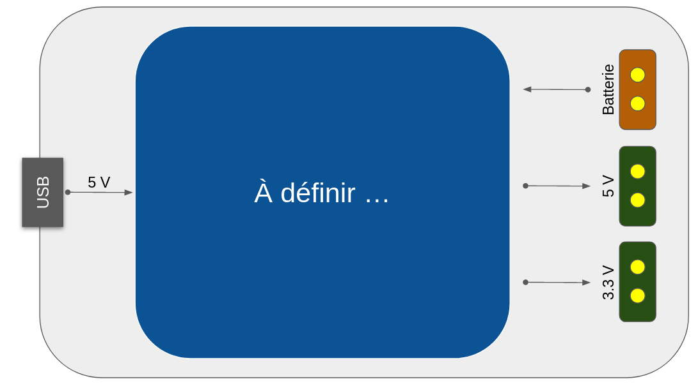
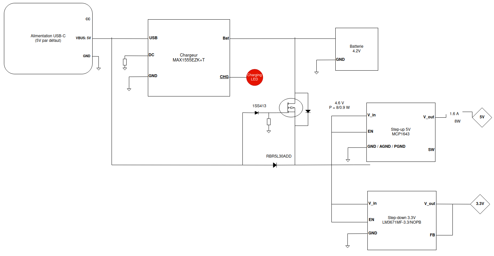
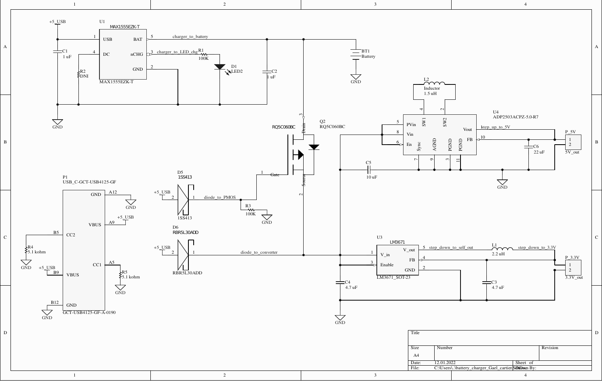
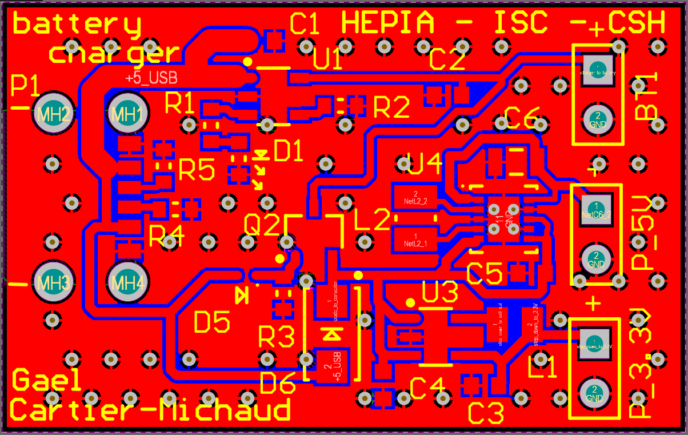

HEPIA -ISC - Gaël Cartier-Michaud

## Conception de systèmes hardware

# Rapport - Chargeur de batterie

### Enoncé du projet

Le travail à réaliser lors de ce premier projet était de concevoir un PCB dédié aux tâches suivantes : 

- charger une batterie via une alimentation USB,
- fournir une alimentation 5V (même sans la batterie branchée et l'USB connecté),
- fournir une alimentation 3.3V (même sans la batterie branchée et l'USB connecté).

### Architecture et choix et de la solution

L'alimentation du PCB via l'USB sera de 5V. Les batteries que nous utilisons ont une tension nominale de 3.7 V, et chargent à 4.2 V.

Le premier composant nécéssaire sera un chargeur de batterie. Celui-ci permettra d'adapter la tension de 5V reçu par l'USB à celle de 4.2V pour charger la batterie.
Le chargeur que j'ai choisi est le *MAX1555EZK+T* de *Maxim integrated*.
Mon choix s'est porté sur ce composant pour le chargeur de batterie pour les raisons suivantes :  

- tout d'abord il exécute la fonction recherchée, tout en étant simple et minimaliste. Il comporte peu de pins et a un pitch de 0.95, ce qui simplifie sa soudure.
- il possède un pin permettant d'indiquer si la batterie est en cours de charge si une LED y est connectée.
- Il possède un mode de précharge dans le cas où la tension de sortie de la batterie est infèrieure à 3V. Dans ce cas là le courant de charge de la batterie est limité à 40 mA.
- caractéristiques :  
  - tension fournie pour le chargement de la batterie : 4.2 V  
  - courant de chargement de la batterie :  
    - via DC : 220 à 340 mA, 
    - via USB : 80 à 100 mA.

Ensuite, il nous faudra un step-down qui nous permettra d'adapter la tension d'alimentation en fonction des situations à la tension de sortie voulue de 3.3V.
Le step-down choisi est le converstisseur *LM3671MF-3.3/NOPB* de *Texas Instruments*. J'ai choisi ce composant aussi pour sa simplicité : 5 pins et un pitch de 0.95. Il accepte en entrée une tension entre 0.2 V et 6 V, ce qui comprend les tensions de la batterie, ou celle d'alimentation de l'USB. En sortie il founit un courant de 600 mA. Il réalise donc la tâche recherchée, tout en présentant un packaging relativement compact et facile à souder.

Enfin, nous aurons besoin d'un step-up pour assurer la bonne tension à la sortie 5V autant dans la situation où nous sommes connectés à l'USB avec une alimention d'entrée de 5V, que quand nous avons seulement la batterie connectée, et auquel cas la tension d'alimentation du cicuit peut varier entre 3V et 4.2V.
Le step-up (ou convertisseur DC-DC) choisi est le *ADP2503ACPZ-5.0-R7* de *Analog devices*. Ce composant accepte en entrée une tension entre 2.3 V et 5.5 V, soit des tensions compatibles avec celles founies par la batterie ou l'alimentation USB. Son courant de sortie est de 600 mA.

Lorsque l'USB est branché pour recharger la batterie, j'ai aussi souhaité que l'alimentation permettant d'obtenir le 5 V et les 3.3 V aux deux sorties provienne directement de l'USB est non de la batterie. De cette manière, la batterie ne fait qu'être chargée si nécéssaire.  
Pour obtenir ce comportement j'ai utilisé un transistor PMOS et deux diodes schottky. En effet. comme il est possible de voir sur le schéma du circuit, lorsque l'USB est branché le potentiel de tension est plus important à la source du PMOS, et il n'y pas de différentiel de tension entre la source et la grille. Donc le transistor n'est pas passant. L'USB alimente seul les convertisseurs DC-DC. En revanche, lorsque l'USB est débranché, la batterie fera passé dans un premier temps une tension par la diode de protection du transistor. Ceci créé alors une charge au niveau de la source et un différentiel de tension entre la source et la grille. Le transistor devient ainsi passant, et la batterie alimente seul les convertisseurs DC-DC. Les diodes shchottky permettent d'éviter tout court-circuit.

Le port USB-C choisi est spécifiquement dédié à une fonction de chargeur. Il est donc pourvu de seulement 6 pins. Ceci permet aussi de simplifier l'assemblage du PCB.  

Tout les autres composants du circuit: résistances, bobines, condensateurs, ont été choisi en accord avec les recommandations de la documentations des composants précédement cités.

### Schémas

Les deux figures suivantes correspondent aux schémas du chargeur de batterie. Le premier est un schéma bloc présentant les principaux composants constituant la logique du circuit, ainsi que leur agencement entre eux. Le second schéma est le schéma du circuit électronique du circuit. Ce dernier pésente l'ensemble des composants électroniques dont le circuit est constitué.  

Sur ceux-ci nous pouvons retrouver les 3 principaux composants du circuit précédemment cités :  

- le chargeur de batterie : MAX1555EZK+T (__U1__),
- le step-up : ADP2503ACPZ-5.0-R7 (__U4__),
- le step-down : LM3671 (__U3__).  

Le composant RQ5C060BC (__Q2__) est le transistor PMOS permettant de changer la source d'alimentation des ports P_5V et P_3.3V suivant si l'USB-C (__P1__) est branché ou non.

### Layout du PCB

La figure 4 présente le layout du PCB correspondant au schéma électrique précédement présenté. Sur celui-ci, les différents composants électroniques sont convenablement routés les unx aux autres pour satisfaire la logique du schéma électrique.  

  

### Résultats et conclusion

 La figure 5 est la photo du PCB avec les différents composants électroniques soudés dessus.   

    

Le tableau suivant présente la tension obtenue et son bruit associé, sur les deux ports de sortie du chargeur, lorsque le PCB est alimenté via le port USB-C à 5V et 200 mA.

|        | Tension (V) | bruit (mV) |
| ------ | ----------- | ---------- |
| P_5V   | 3.36        | 165        |
| p_3.3V | 5.116       | 350        |

Le tableau suivant présente la tension obtenue et son bruit associé, sur les deux ports de sortie du chargeur, lorsque le PCB est alimenté via une batterie. Pour contrôlé le courant et la tension d'alimentation lors des tests, j'ai remplacé la batterie par une alimentation stable. Les résultats ci-dessous sont valables pour les 3 sitations d'alimentation sur le port de la abtterie suivant :  

- 4.2 V, 200 mA,
- 5 V, 200 mA,  
- 5.5 V, 200 mA,  
- 6 V, 200 mA.

|        | Tension (V) | bruit (mV) |
| ------ | ----------- | ---------- |
| P_5V   | 3.36        | 108        |
| p_3.3V | 5.12        | 350        |
|        |             |            |

Lors des tests avec une alimentation via batterie avec une tension de 3V et 200 mA, les résultats suivants ont été obtenu :  

|        | Tension (V) | bruit (mV) |
| ------ | ----------- | ---------- |
| P_5V   | 3.009       | 300        |
| p_3.3V | 5.106       | 300        |

Lors de ce dernier cas on peut observer que dans le cas d'une batterie faiblement chargée la tension du port 3.3V ne sera pas garantie, et présentera une variation plus importante que dans les autres situations, tout en restant acceptable.  

Par ailleurs, la LED __D1__ du circuit prévue pour servir de témoin de charge ne fonctionne par sur le PCB. En effet, il se trouve que le pin nCHG du chargeur de batterie est mis à la masse lorsque la batterie est en cours de charge, et est en haute impédance lorsque la batterie est pleinement chargée.  
Donc pour que ce montage fonctionne avec la LED, il aurait fallu faire partir une piste de l'alimentation 5V de l'USB vers la LED, puis une autre de la LED vers le nCHG. 
