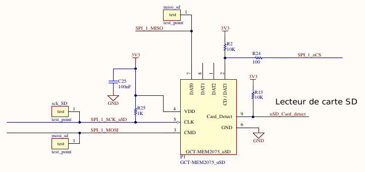

HEPIA - ISC - 2022 / 2023 - Gaël Cartier-Michaud  
  
## Projet en systèmes embarqués  
# Conception d'une station météorologique connectée   
  
## 1. Enoncé du projet  
 Le but de ce projet est de développer un petit système embarqué. Celui-ci doit répondre aux contraintes suivantes :  
 - utiliser un microcontrôleur,  
 - posséder un connecteur de debug type JTAG ou SWDIO,   
 - utiliser une interface SPI ou I2C,  
 - utiliser une mémoire externe accessible par SPI ou I2C,   
 - avoir une interface série de type UART,  
 - utiliser une LED rgb de type WS2812 ou APA-102 chaînable.   

 Ce projet se voulant embarqué il doit pouvoir être alimenté via une batterie et être rechargeable.  

## 2. Description du projet  
Le choix de projet s'est porté sur la réalisation d'une station météo connectée. Cette station pourra mesurer la température ambiante, la pression atmosphérique, l'humidité de l'air et la luminosité ambiante. Ces mesures seront affichables sur un écran LCD, mais elles pourront aussi être récupérées en se connectant par bluetooth à l'appareil ou au moyen d'une carte micro-SD. L'interface de l'appareil sera commandable au moyen d'un écran tactile ou de sa connexion bluetooth. 
Enfin, essentiellement à des fins de debug, la station pourra être reliée à l'ordinateur au moyen de son port USB-C et envoyer des logs de son activité par UART. 

## 3. Choix des composants et conception du projet  
L'appareil sera alimenté grâce au chargeur de batterie conçu au cours du premier semestre de cette année. Il permet de délivrer une tension stable de 3.3V et de 5V à partir d'une batterie ou d'une tension fournie via un port USB. 
Le choix du microcontrôleur s'est porté sur le RP2040 de Raspberry Pi. Ce dernier utilise un processeur ARM cortex M0+ possédant 2 coeurs cadencés à 133 MHz. Il fournit deux ports I2C, deux ports SPI et deux ports UART qui seront utiles aux différents périphériques qui lui seront raccordés. Il met à dispositions 30 pin GPIO. Pour stocker son programme, le RP2040 nécessite une mémoire flash externe. Pour cela on utilisera la mémoire W25Q128JVSIQ de 128 MB branchée en QSPI au microcontrôleur. 
Pour répondre aux contraintes, la Led RGB choisie est une sk9822. Celle-ci est commandable via SPI avec les signaux *clock* et *MOSI*.  
Le lecteur de carte SD sélectionné est le MEM2075-00-140-01-A et est aussi commandé en SPI.  
L'écran LCD choisi est un écran 2.8" de 240 x 320 pixels : le ILI9341. Il sera aussi commandé par SPI afin de bénéficier de la vitesse de transfert de ce protocole et obtenir un affichage le plus fluide possible. Cet écran est recouvert d'une dalle tactile : la FT6236U. Celle-ci communiquera avec le microcontrôleur par I2C.
Le capteur de température, humidité et pression atmosphérique est le BME280. Le capteur de lumière est le VEML7700. Ces deux capteurs seront aussi reliés par I2C au microcontrôleur.
Enfin, le module blutooth qu'utilisera la station météo est le RN4678 de Microship. Celui-ci se commande par commandes *AT* en UART.  
  
La figure \ref{schema_bloc} présente le schéma bloc de la station météo.  

    
  
## 4. Réalisation du système embarqué

### A. Schéma électrique
  
__- led rgb sk9822 :__    
La figure \ref{led_rgb} présente le schéma électrique de raccordement de la led RGB au microcontrôleur. Comme il est possible de voir cette Led est alimenté en 5V, et ses signaux logiques doivent aussi être en 5V. Or les GPIO du RP2040 fournissent une tension 3.3 V. J'ai donc utilisé le convertisseur de niveaux logiques SN74LXC2T45DTTR pour adapter les signaux SPI de 3.3V à 5V. La led RGB communique avec le RP2040 sur le port SPI 1.

 
    
      
__- lecteur de carte SD :__      
La figure \ref{sd} présente le schéma électrique de raccordement du lecteur de carte micro-SD au microcontrôleur. Comme il est possible de voir, le lecteur de carte SD est sur le même port SPI que la Led RGB. Or, la Led RGB ne possède pas de pin CS (*Chip Select*). Pour permettre une communication bien distincte entre le RP2040 et ces deux périphériques j'ai utilisé un pin SPI_SCK pour le signal de *clock* différent pour chacun d'eux. Ainsi pour communiquer avec la led RGB ou le lecteur SD il sera nécessaire d'initialiser le pin SPI_SCK du périphérique voulu, et de désactiver le pin correspondant de l'autre périphérique.

   

    
__- Connecteur de l'écran LCD et de la dalle tactile :__  
La figure \ref{lcd} présente le schéma électrique de raccordement du connecteur de l'écran LCD et de la dalle tactile au microcontrôleur. L'écran LCD étant un périphérique qui sera potentiellement souvent utilisé et nécessitant des échanges de données relativement importants il a été placé seul sur le port SPI 0 du RP2040. De la même manière, lorsque l'on interagit avec la dalle tactile, il peut être important de ne pas louper un évènement. Il est donc important que son port de communication I2C soit toujours disponible. C'est pourquoi elle est seule sur le port I2C 0. Le pin CTP_IRQ a pour but de déclencher une interruption sur le RP2040 lorsqu'un évènement intervient sur la dalle tactile. Suite à cette interruption une lecture des registres de position de la dalle tactile sera effectuée pour définir la localisation (coordonnées x et y) de l'évènement.

  
  
  
__- Capteurs de luminosité, de température, d'humidité de l'air et de pression atmosphérique :__  
La figure \ref{sensors} présente les schémas électriques de raccordement des capteurs BME280 (température, humidité et pression atmosphérique) et VEML7700 (luminosité) au microcontrôleur. Ces deux capteurs communiquent avec le RP2040 via le port I2C 1.

    
  

  \newpage
__- Module bluetooth :__  
La figure \ref{ble} présente le schéma électrique de raccordement du module bluetooth Microship RN4678 au microcontrôleur. Voulant développer un système embarqué autonome en énergie et pouvant fonctionner au moyen d'une batterie, nous recherchons des périphériques consommant le moins possible. C'est pourquoi un transistor a été placé au niveau de l'alimentation du module bluetooth. Celui-ci permet de couper son alimentation lorsqu'il n'est pas utilisé. En effet, sans celui-ci le module consomme 280 uA en *deep sleep mode*.   
Par ailleurs ce module peut être alimenté via une tension comprise entre 3.3 et 4.2 V. L'alimentation développée durant le 1er semestre pouvant présenter une variation de plus ou moins 300 mV, les 3.3 V en entrée du module bluetooth ne sont pas toujours garantie. C'est pourquoi, il a été permis à l'aide de résistance 0 ohm d'alimenter le module blutooth soit avec l'alimentation 3.3 V, soit directement depuis la batterie.   
Les *switchs* du composant U13 permettent de tirer individuellement à la masse les pins P2.0, P2.4 et EAN, par défaut *pull-up* pour changer les paramètres du système du module et, si on le souhaite, pouvoir mettre à jour le firmware du module par UART.

    

\newpage
__- Mémoire flash :__  
La figure \ref{storage} présente le schéma électrique de raccordement de la mémoire flash au microcontrôleur. Celle-ci est sur le port QSPI du RP2040. Le composant U5 est un bouton permettant de tirer vers le bas le pin *nCS* au moment du boot du système de manière à booter en mode UF2. A ce moment-là on peut facilement mettre à jour le *software* du système à l'aide d'un simple *drag and drop* d'un binaire UF2 monter sur l'ordinateur.   
      
{width=50%}

__- Oscillateur :__    
La figure \ref{crystal} présente le schéma électrique de raccordement de l'oscillateur au microcontrôleur.   
  
{width=20%}  

\newpage
__- Microcontrôleur :__    
La figure \ref{rp2040} présente le schéma électrique du microcontrôleur rp2040.
  
 
  
  
\newpage  
  
### B. Layout du PCB  

Le PCB a été conçu en 4 couches. L'ensemble des pistes sont presque exclusivement sur les couches du haut (*top*) et du bas (*bottom*). Des plans de masse sont présents sur les couches *top*, *bottom*, et sur la couche intermédiaire 3. De cette manière, la paire différentielle reliant Dn / Dp de l'USB au microcontrôleur est bien isolé et peut respecter l'impédance de 90 ohms exigée. La couche 2 du PCB est un plan pour l'alimentation de 3.3V. 
L'ensemble des plans des différentes couches ont été coupés sous la *footprint* du module bluetooth pour perturber le moins possible le signal de son antenne intégrée.  
La figure \ref{top_l} présente le layout du top layer du PCB.  
  
  
  
La figure \ref{bottom_l} présente le layout du bottom layer du PCB.  
  
    
  
\newpage
      
### C. Production du système     
Les figures \ref{3d_top} et \ref{3d_bottom} représentent les vues 3D de dessus et de dessous de comment sera la station météo.
    
  
  
    
   
  
    
Les figures \ref{top_pcb} et \ref{bottom_pcb} sont des photos du PCB une fois les différents composants soudés dessus et l'écran LCD relié au connecteur.  
  
  
  
    
    
  
\newpage  
  
## 5. Tests du système  
Suite à l'assemblage du PCB, différents tests ont été effectués dans la mesure du temps disponible.
Parmi ce qui a été testé et qui fonctionnent il y a : l'alimentation, la communication SPI avec la LED rgb, la communication SPI avec l'écran LCD, la communication I2C avec la dalle tactile, la communication UART via USB, et la communication I2C avec le capteur de lumière.  
La communication I2C avec le capteur BME280 ne fonctionne malheureusement pas du fait d'une inversion en miroir des pins sur sa footprint. Par ailleurs, les pins *rx* et *tx* de l'UART du module bluetooth sont probablement inversées. Cependant, ce module n'a pas encore été testé. 
Le lecteur de la carte micro SD n'a pas non plus été testé encore.  
 
## 6. Améliorations en vue d'une version 2.  

  En vue d'une nouvelle version de ce système différentes améliorations peuvent être apportées. Tout d'abord, la *footprint* du BME280 doit être corrigée. Ensuite, les pins *rx* et *tx* du module bluetooth doivent surement être inversée.  Enfin le module bluetooth peut être changé par un module Microship RN4870. Ce dernier utilise la même footprint que le module actuellement utilisé mais il accepte une tension d'alimentation entre 1.9 et 3.6 V. Ceci permettrait de simplifier le circuit. Aussi, la gestion du mode pour reprogrammer le firmware du module par UART ce fait avec la seule pin 2.0.  
    

\newpage  

## Annexe  
### Schéma électrique de l'alimentation.  

{width=80%}  

